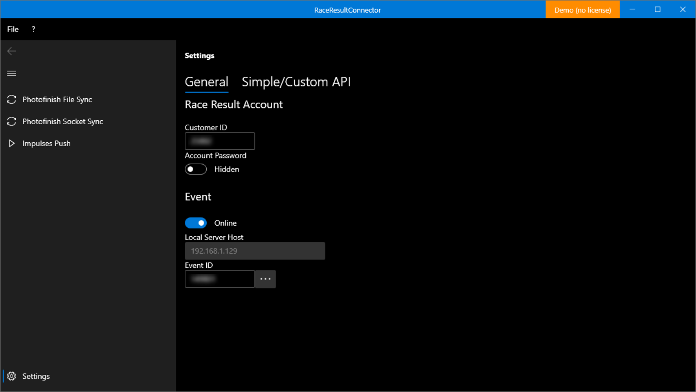
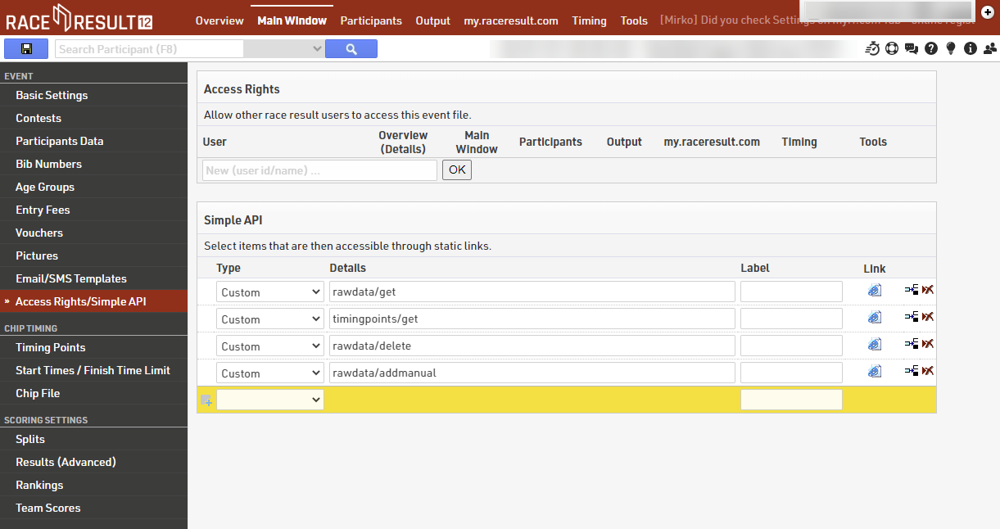
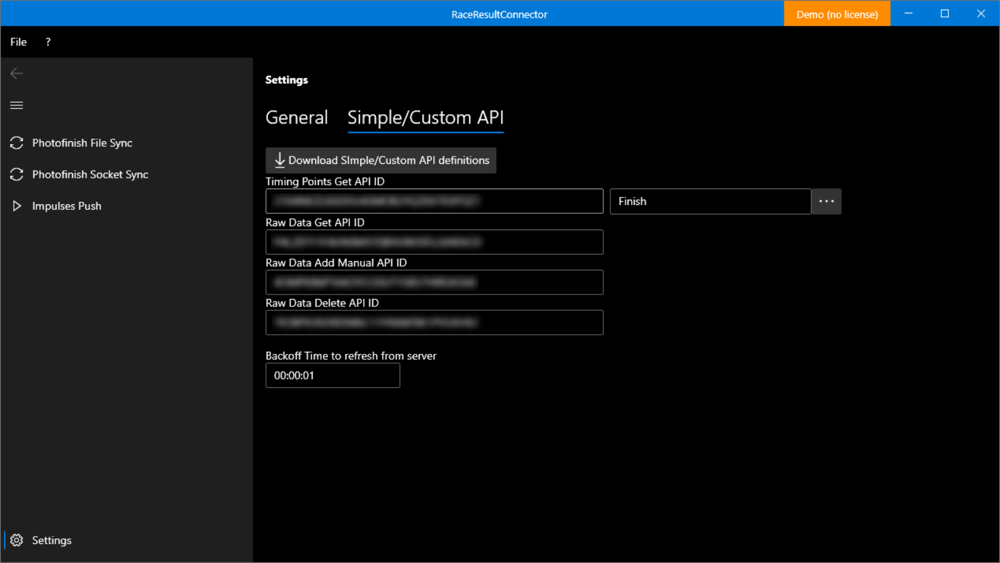

# Configuration

Most settings need to be done in the software itself (`Settings` button in the navigation panel to the left), some settings directly in Race Result 12.

## 1. Link Race Result Account and Event `RaceResultExchange`

The license is tied to your Race Result customer ID and is therefore already populated. If you are running a demo version, you can enter the customer ID manually. Also the account’s pasword need to be entered.

All events need to be available in your Race Result online account. Still you can check your event out and using it off-line. Tick the apropriate checkbox, and if off-line mode, specify the hostname of the computer running the Race Result Web server.

Click on the three dots button to fetch all events from your account and select the one you want to use.

## 1. Setup Race Result Event `Race Result 12`

In order to be able to interact with Race Result, you need to setup distinct Simple API endpoints and link it to the connector. Thes ednpoints are valid only for the given event and need to be created for each event you want to use.

Start Race Result 12 from your online account and go to your event. In Main Window go to Access Rights/Simple API. Now you need to add the following four Simple API rows – all of Type Custom:

* rawdata/get
* rawdata/delete
* rawdata/addmanual
* timingpoints/get

## 1. Setup Race Result API `RaceResultExchange`

Now we need to let the connector know the endpoints we just created. Go to Simple/Custom API tab and click the Download button. Now all endpoints will have some text in it.

Next click on the button with the three dots and select the timing point you want to use.

