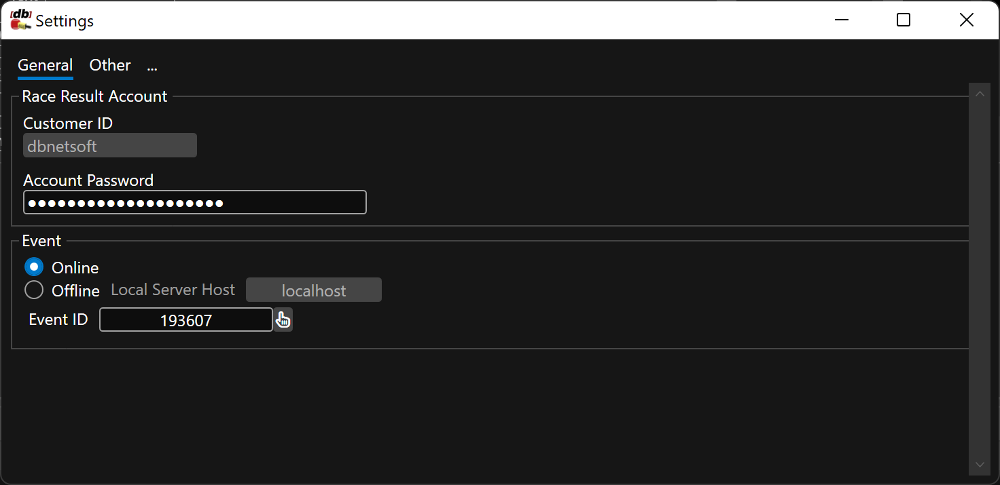

# Configuration

A couple of steps have to be done in order to link RaceResult12 and RaceResultExchange. 

## Link Race Result Account and Event

This settings can be found in `File` - `Settings`:

* The Customer ID is bound to yur license and already pre-filled
* Enter the password for this customer ID in RR12
* Select if you want to use an event that is online or offline. When working offline please specify the IP address of the computer running RR12 or `localhost` for the same machine
* Select an event to be working with (you can also select the event from the Main window)

Most settings need to be done in the software itself (`Settings` button in the navigation panel to the left), some settings directly in Race Result 12.

## Setup Race Result Event

The RR12 event does not need to be setup in any specific way. Our tool will get the data directly and is not relying on Simple API definitions.

In order to use trigger sendings or drive display boards, RRExchange needs to receive the passings instantly to act upon them. This is achieved by Exports. You have to create one exporter and have it connect to RRExchange: 

* Create one exporter as follows:
    * Apply to all Timing Points
    * No filter
    * Destination is port 3611 on the machine that the RREXchange is running on (local webserver needs to be started usually)
    * Export Data needs to contain the Timing point name and bib number in that order like so: `[RD_TimingPoint] & ";" & [RD_Bib]`

    