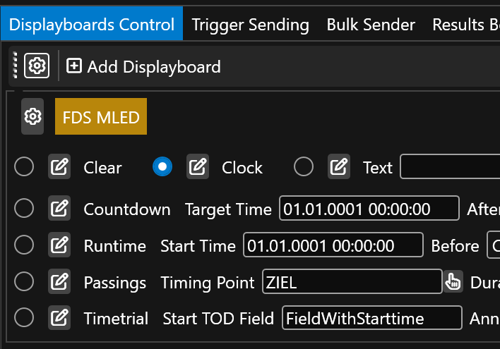
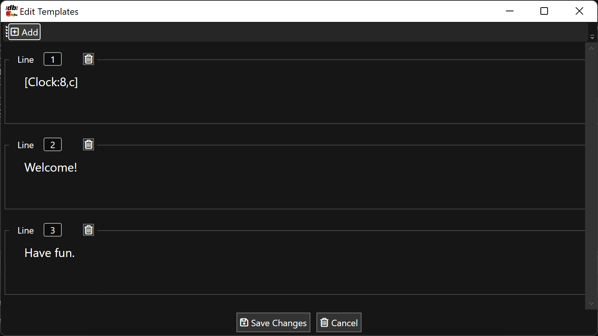

# FDS MLED

## Setup

FDS MLED displayboards provide multi-line, formattable canvas. 

The following operation modes are provided: 

* `Clear` shows the clear template (usually is for blanking the board)
* `Clock` shows the clock template (usually  is for showing current time of day)
* `Text` shows the freetext template 
* `Countdown`shows the countdown template (usually for counting down to a target time)
* `Runtime` shows the runtime template (usually for running up from a target time)
* `Passings` shows the passings template
* `Timetrial` shows the time trial template

Templates can contain any information, but it is good practice to at least show what it is supposed to show (e.g. one can show blank in the clock template, but it makes sense to show a clock there).

The operation modes can be switched to by selecting them: 

## Templates

The templates for each mode can be edited by clicking on the Pen button next to each select box. 

One can add as many rows are are supported by your MLED panel configuration. For instance if you have three panels across, then line 1 (A) will show 8 big characters, line 2(B) and line 3 (C) will show two smaller lines with each 16 characters. This can also be configuted in the FDS MLED Setup program. In RRExchage, you can have as many lines as you whish. 

Each line composes of text. This text can either bei plain text (e.g. `Welcome`) or contains content from a field (e.g. `[clock]`) and fields can also be mixed with formatters (e.g. `[clock:8,c]`). Please see the [formatting](fdsmled_formatting.md) for further details.

## Placeholders

You can use the following placeholders everywhere: 

* `clock` contains the current time of day
* `countdown` contains the countdown to the given target time
* `runtime` contains the running time from the given target time
* `textline{x}]` contains the freetext lines, replace {x} with your line number starting from 1

In Time trial mode, the following placeholders can be used in addition: 

* `runningtime` contains the running time of the athlete expected next to finish (calculated locally by using the field specified in "Start TOD Field")