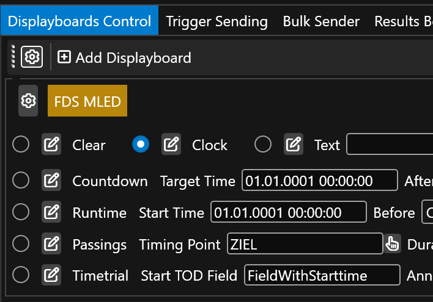
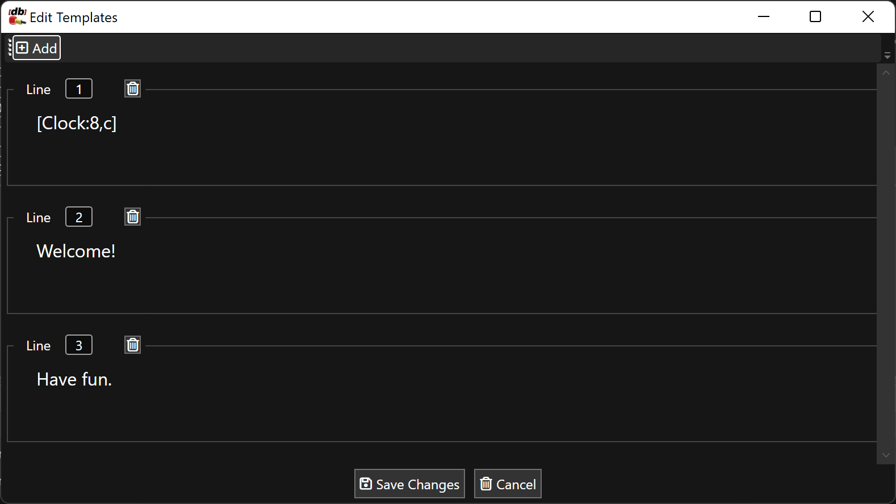

# FDS MLED

## Setup

FDS MLED displayboards provide multi-line, formattable canvas. 

Templates can contain any information, but it is good practice to at least show what it is supposed to show (e.g. one can show blank in the clock template, but it makes sense to show a clock there).

The operation modes can be switched to by selecting them: 

## Templates

The templates for each mode can be edited by clicking on the Pen button next to each select box. 

One can add as many rows are are supported by your MLED panel configuration. For instance if you have three panels across, then line 1 (A) will show 8 big characters, line 2(B) and line 3 (C) will show two smaller lines with each 16 characters. This can also be configuted in the FDS MLED Setup program. In RRExchage, you can have as many lines as you whish. 

Each line composes of text. This text can either be plain text (e.g. `Welcome`) or contains content from a field (e.g. `[Bib]`) and fields can also be mixed with formatters (e.g. `{{ Clock | FormatRaceResult "hh:mm" }}`). Please see the [scripting](scripting.md) for further details.

