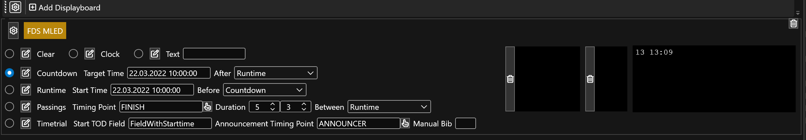
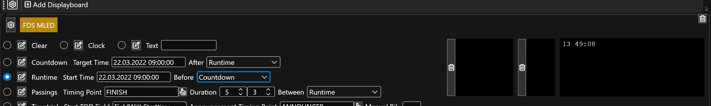
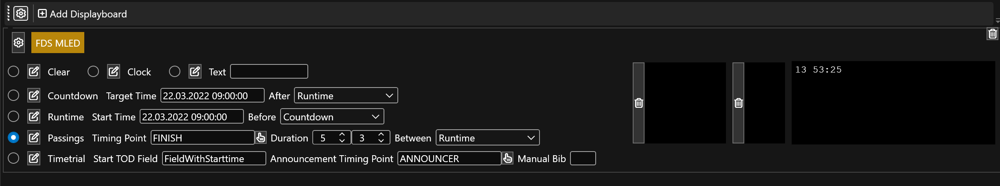

# Operation Modes

## Overview

The following operation modes are provided: 

* `Clear` shows the clear template (usually is for blanking the board)
* `Clock` shows the clock template (usually  is for showing current time of day)
* `Text` shows the freetext template 
* `Countdown`shows the countdown template (usually for counting down to a target time)
* `Runtime` shows the runtime template (usually for running up from a target time)
* `Passings` shows the passings template
* `Timetrial` shows the time trial template

For a list of all possible placeholders to be used in the templates see [formatting](fdsmled_formatting.md) for further details.

## Countdown Mode

In countdown mode, the field `[countdown]` is counting down a target time. After the target time is reached, you can select what mode to show next (e.g. stay on the countdown mode or show the runtime mode).

## Runtime Mode

In runtime mode, the field `[runtime]` is counting up from a target time. Before the target time is reached, you can select what mode to show first (e.g. stay on the runtime mode or show the countdown or clock).

## Passings Mode

This mode is suitable for showing the result whenever an athlete cross a timing point. When several athletes cross the timing point in short intervals, the passings are queued up and the interval can be specified when switching. 

For this to work oyu have to setup the following:

* Select the timing point to listen to for passings
* Enter the duration for switching from passings mode to idle mode (e.g. 5s after a passing happened fall back to idle mode)
* Enter the duration for switching between passings if more than one is queued up (e.g. 3s to faster iterate through the queue)
* Select a mode to display when idle, meaing when no passing happened.

In the box on the right you see the bib numbers are currently queued up. 

## Timetrial Mode

This mode is suitable for showing a running time for a specific competitor that passes an announcement line or is manually select and then show the result whenever the athlete cross the next timing point. When several athletes cross the timing point in short intervals, the passings are queued up and the interval can be specified when switching. 

For this to work oyu have to setup the following:

* For being able to calculate a running time, RRExchange needs to know the StartTOD of the athlete. Specify the field name that contains the TOD.
* Select the announcement timing point to listen to for passings that are then set to next to finish
* Select the timing point to listen to for passings to show the passings
* Enter the duration for switching from passings mode to idle mode (e.g. 5s after a passing happened fall back to idle mode)
* Enter the duration for switching between passings if more than one is queued up (e.g. 3s to faster iterate through the queue)
* Select a mode to display when idle, meaing when no passing happened.

The timetrial templazte will be used before the finish, the passings template will be used when finished.

In the box on the right you see the bib numbers are currently queued up at the finish and also queued up for arriving next at the finish. 

