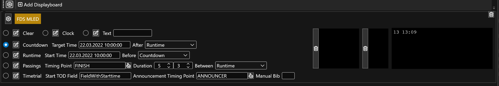

# Countdown

In countdown mode, the display is counting down a reference time. After the target time is reached, you can select what mode to show next (e.g. stay on the countdown mode or show the runtime mode).

* `{{ Countdown }} (timespan)` holds the remaining time until the reference time 
* `{{ ReferenceTime }} (datetime)` holds the reference time the countdown is reference towards

