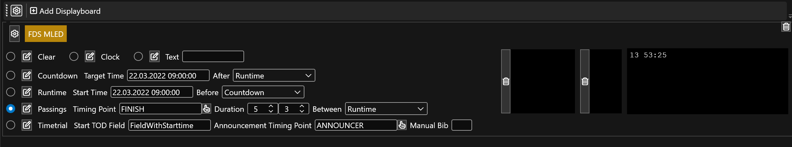

# Passings Mode

This mode is suitable for showing the result whenever an athlete cross a timing point. When several athletes cross the timing point in short intervals, the passings are queued up and the interval can be specified when switching. 

For this to work oyu have to setup the following:

* Select the timing point to listen to for passings
* Enter the duration for switching from passings mode to idle mode (e.g. 5s after a passing happened fall back to idle mode)
* Enter the duration for switching between passings if more than one is queued up (e.g. 3s to faster iterate through the queue)
* Select a mode to display when idle, meaing when no passing happened.

In the box on the right you see the bib numbers are currently queued up. 

