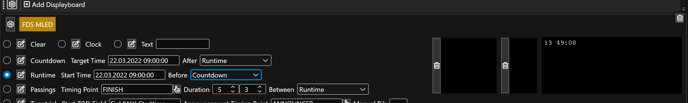

# Runtime Mode

In runtime mode, the display is counting up from a reference time. Before the target time is reached, you can select what mode to show first (e.g. stay on the runtime mode or show the countdown or clock).

* `{{ Runtime }} (timespan)` holds the time elapsed since the reference time 
* `{{ ReferenceTime }} (datetime)` holds the reference time the runtime is running from

