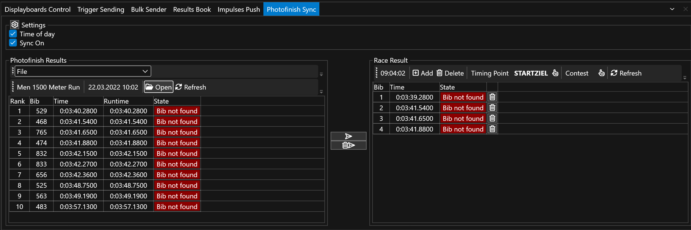
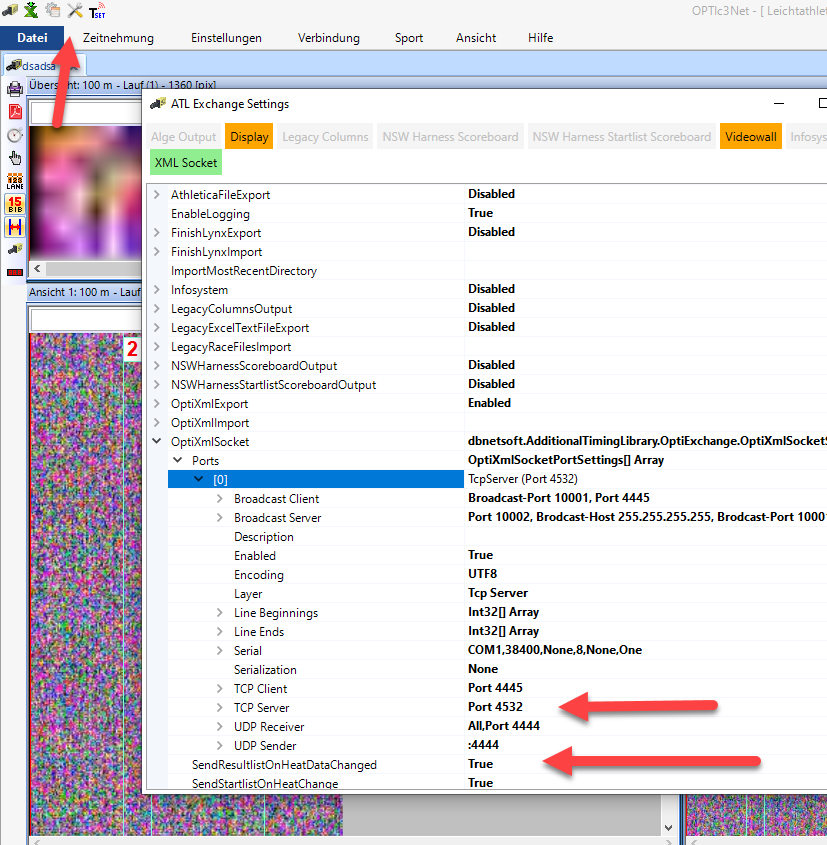

# Photofinish Sync

Bring the `Photofinish Sync` view to front and select it.

In order to sync automatically on any change, tick the `Sync On` checkbox. 

Also select if you want to sync Time Of Day (`Time of Day` checked) or the runtime. This depends if the source provices both (ALGE-Timing OptiC3 provides both, LIF files only the runtime). 

On the right, you can select the `Timing Point` to write the photofinish time to. 

Also on the right, you can select a `Contest` to not overwrite reuslts from other contests - or select all contests. 

## Usage Modes

### Photofinish File Sync

Select `File` in the left box.
Select the file containing the photofinish results form a network drive or local drive. This is a `*.LIF` file or a `*.HEATRESULTXML` file for OptiC3. 

### Potofinish Socket Sync

The connector can receive photofinish results directly via a socket (and not tedious files on network shares) by ALGE-Timing OptiC3.NET software or our own Photofinish software. 

Select `Socket` in the left box.
You can configure the port for the socket sync by right-clicking on the Results Port label and click Settings. 

#### Setup ALGE-Timing OptiC3.NET for socket sync

Go to the ATL Settings in top icon menu and open OptiXmlSocket. There you can specifiy the TCP port or leave the default (4532). Make sure to have SendResultlistOnHeatDataChanged enabled, as otherwise results are only sent when pushing them manually.
