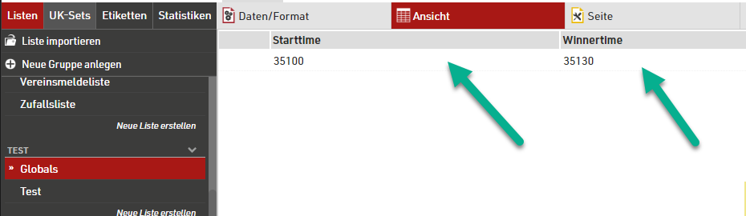
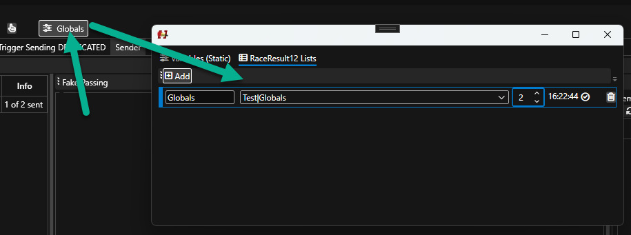

# Examples

## Clock with flashing separator

The current clock is captured in the variable `now`. Then we compare the datetime's Second property and see if it is even. Depending on the output of this comparison the clock is formatted with different formatters. Either way, the last line trim's the output and aligns it center.

    {{
    now = date.Now
    if now.Second  %2 == 0
        nowString = now | Format "HH:mm"
    else
        nowString = now | Format "HH mm"
    end
    nowString | TrimPad 8 "Center"
    }}

## Conditional formatting of diff time

The diff field from RR12 is captured in the variable diffString. Then it is checked if the string starts with a "-". If so, set the color variable to green, otherwise to red. After that the color is output together with the diff string and trimmed.

    {{ 
    diffString = "+1.45"
    colorString = ""
    if string.StartsWith diffString "-"
        colorString = "Green"
    else 
        colorString = "Red"
    end
    (mled.Color colorString) + (TrimPad diffString 8 "Right")
    }}

## Use of globals

The following script allows to show the current clock before the start of the race, a runtime during the race and a gap time to winner as soon as the first athlete finishes. 

This can be achieved by having the race start TOD and the winner TOD available in a RR12 list. The actual content of these values depend on your event file setup.

This list is then pulled via RRExchange globals feature periodically into the software. 

The pulled global list entries are available as variables in each script then. They are identified by <NameOfGlobal>.First.<RR12FieldName>, e.g. `Globals.First.Starttime` for a RR12 field named `Starttime` in a globals list `Globals`.

    {{
    # Get current TOD and convert to seconds
    now = timespan.Now | ToSeconds

    # Fetch race start time and winner time from Globals List and convert to seconds (this way RR12 field can be seconds or HH:mm:ss string
    raceStartedAt = Globals.First.Starttime | ToSeconds
    winnerFinishedAt = Globals.First.Winnertime  | ToSeconds

    # Determine race states
    isRaceStarted = raceStartedAt > 0

    # Determine output based on is race started or not
    if isRaceStarted 
        # Race is started, check for winner time is present    
        isWinnerFinished = winnerFinishedAt > 0
        
        if (isWinnerFinished)
            # Winnner is finished, show gap time
            
            # Change color
            mled.Color "Red" 

            # Calculate gap time
            timeSinceWinner = now - winnerFinishedAt
            # Output formatted with + sign, trim to 8 places and right-align
            timeSinceWinner | FormatRaceResult "+HH:Mm:ss" | TrimPad 8 "Right"
            
        else 
            # No winner present, show running time
        
            # Change color
            mled.Color "Green" 

            # Calculate runtime
            timeSinceStart = now - raceStartedAt
            # Output formatted, trim to 8 places and right-align
            timeSinceStart | FormatRaceResult "HH:Mm:ss" | TrimPad 8 "Right"
        
        end
        
    else 
        # Before Start

        # Switch to White
        mled.Color "White" 
    
        # Output formatted, trim to 8 places and right-align
        now | FormatRaceResult "hh:mm:ss" | TrimPad 8 "Right"
    
        
    end
    }}
