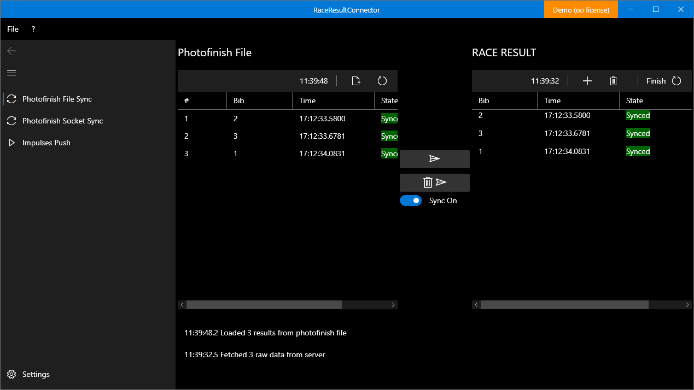
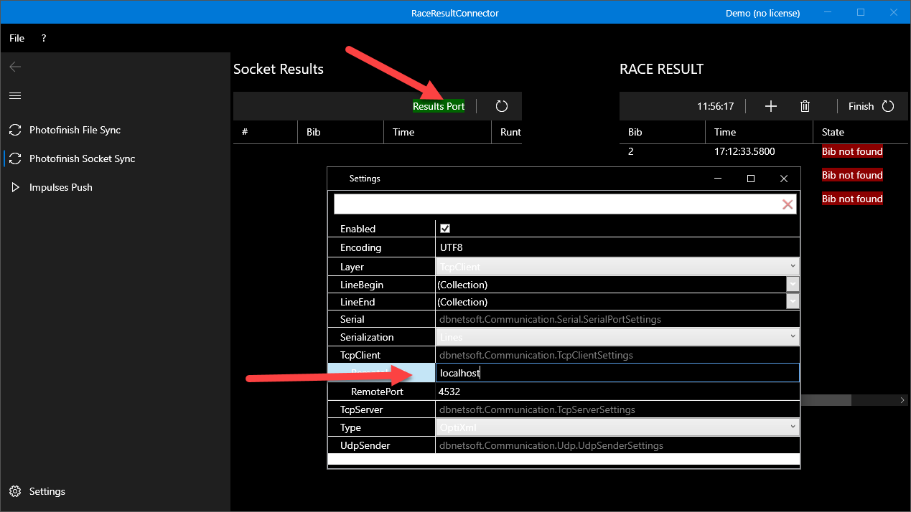

# Usage

Start RaceResultExchange by using the desktop icon.

If you are running a demo or trial version, a message box will inform you right away. Otherwise if you have a valid license you will see the details in the top right corner in green. 

Upon the first start or whenever you change the event you want to work with go through this [settings information](configuration.md).

## Photofinish File Sync

### Introduction

RaceResultExchange can be linked to a results file on disk or a network share and constantly monitor it for changes. If changes are detected, RaceResultExchange can automatically upload the changed data to Race Result event.

Go to Photofinish File Sync in the navigation to the left. This mode stays active as long as you stay on this page. 

### Overview

The contents of the photofinish results file are displayed to the left, the current contents of the timing point in Race Result are displayed to the right. On each result row, one can see if the timestamp is synced or not. 

### Walkthrough

1. Tick the toggle button and set it to “Sync On” – with this enabled, changes in the photofinish file are automatically synced 
2. Click on the “Load Photofinish” button and select the results file from the photofinish software
3. The contents of the file are automatically pushed to Race Result and you should see the exact same results to the right 
If you want to not auto sync you can manually click the “Push Results” buttons in the middle to sync once.

## Photofinish Socket Sync

### Introduction
The connector can receive photofinish results directly via a socket (and not tedious files on network shares) by ALGE-Timing OptiC3.NET software or our own Photofinish software. 

Go to Photofinish Socket Sync in the navigation to the left. This mode stays active as long as you stay on this page

### Setup ALGE-Timing OptiC3.NET

Go to the ATL Settings in top icon menu and open OptiXmlSocket. There you can specifiy the TCP port or leave the default (4532). Make sure to have SendResultlistOnHeatDataChanged enabled, as otherwise results are only sent when pushing them manually.

### Config RaceResultExchange

Right-Click on the Results Port button and select Settings. Expand the TcpClient section and enter the IP of the computer running photofinish software (or localhost if same computer). Leave RemotePort at the default (4532) or change to the same value set in the photofinish software.

### Walkthrough

1. Make sure that the Connector is connected to the Photofinish software – the Results Port button must be green. 
1. Set the Sync toggle to Sync On
1. Decide whether you want to sync finish time-of-day or net times (with FinishLynx it does not make a difference as only ALGE products output both time-of-day and net time)
1. In the photofinish software, evaluate a bib number or change results manually. 
1. You should now see the results instantly on the left-hand side