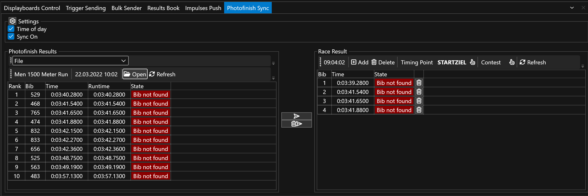

# Photofinish Sync

Bring the `Photofinish Sync` view to front and select it.

<figure><figcaption>
Photofinish Sync View
</figcaption></figure>

In order to sync automatically on any change, tick the `Sync On` checkbox.

Also select if you want to sync Time Of Day (`Time of Day` checked) or the runtime. This depends if the source provices both (ALGE-Timing OptiC3 provides both, LIF files only the runtime).

On the right, you can select the `Timing Point` to write the photofinish time to.

Also on the right, you can select a `Contest` to not overwrite reuslts from other contests - or select all contests.

### Usage Modes 

#### Photofinish File Sync 

File sync establishes a link between a local file (or a file located on a shared network path) and RR12 timing point. Whenever the file changes, RaceResultExchange will publish the changes only.

Select `File` in the left box. Select the file containing the photofinish results form a network drive or local drive. This is a `*.LIF` file for FinishLynx or a `*.HEATRESULTXML` file for OptiC3.

#### Potofinish Socket Sync 

RaceResultExchange can receive photofinish results directly via a network socket by ALGE-Timing OptiC3.NET software or our own [Photofinish software](https://www.dbnetsoft.com/turnkeysoftware/photofinish/).

Select `Socket` in the left box. You can configure the port for the socket sync (default is 4532) and also specify the IP/hostname the photofinish software is running on by right-clicking on the Results Port label and click Settings.

**Setup ALGE-Timing OptiC3.NET for socket sync**

<figure><figcaption>
ALGE Timing OptiC3.NET Configuration
</figcaption></figure>

Go to the ATL Settings in top icon menu and open OptiXmlSocket. There you can specifiy the TCP port or leave the default (4532 in TCP Server section). Make sure to have SendResultlistOnHeatDataChanged enabled, as otherwise results are only sent when pushing them manually. By default, the photofinish software creates a TCP/IP Server and thus RaceResultExchange connects as a TCP/IP Client. The port numbers have to match.
