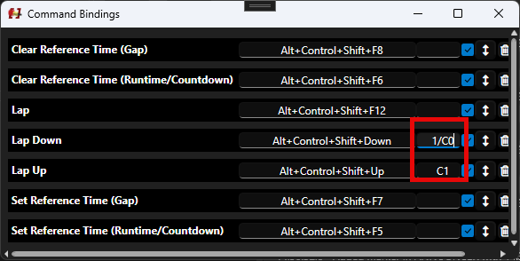

# Release Notes

#### 1.0.107 (2024-04-29)

*   Tome Trial mode in displays can be configured witha timeout, so athletes that do not make it to the finish from announcement are removed\

    <figure><figcaption></figcaption></figure>
* Trigger Functionality: RRExchange can react on ceertain triggers and run some actions. This is possible via the use of web hooks.
  * Currently creation of a new participant is supported as trigger
  * Currently printing a certificateis supported as action
* Our [RemoteRedirect ](https://www.remoteredirect.com)service now also acts a liason between RR12 online and RRExchange locally. This way even exportes and webhooks are woking when remaining in online mode.&#x20;

####

#### 1.0.106 (2024-03-04)

*   When having multiple displayboards configured, individual displayboards can be moved up and down by using right click context menu:\

    <figure><figcaption></figcaption></figure>
