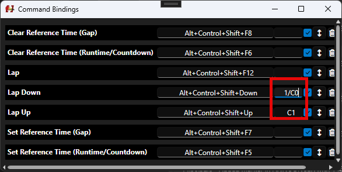

# Globals

Globals are a feature that allows three things:

* Define software-wide variables
* Fetch RR12 lists on a periodically basis
* Fetch any other JSON endpoint

## Variables

Variables will be made available in every script by using it's name.&#x20;

<figure><figcaption></figcaption></figure>

## RR12 Lists

RR12 lists will be fetched peridocally and made available by its name. The list rows are made available by the property `List`. The property `First` will hold the first row for convenience.&#x20;

E.g. when you have a list define with name Test you can access the rows by using `Test.List` or access the third row with `Test.List[2]`.

E.g. a column named Starttime can be access for the first row by using `Test.First.Starttime`.

<figure><figcaption></figcaption></figure>
